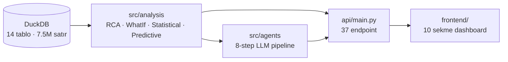

# AGENTS.md — Codex / AI Asistan Onboarding

> Bu dosya OpenAI Codex CLI, Claude Code ve benzeri AI kodlama asistanlarının projeyi 5 dakikada anlaması için yazılmıştır. İnsanlar için `README.md`'ye bakın.

---

## A. Proje Pusulası

**CNC Anomaly Intelligence** — Bursa/Trex CNC fabrika verilerini analiz eden, 12 büyük operasyonel problemi tespit eden, OEE iyileştirme simülasyonları yapan ve **Türkçe AI raporu** üreten multi-agent karar destek sistemi.

**Veri ölçeği**: 9 ay, 12 makine, 7.5M satır telemetri (Fanuc + Mitsubishi + LibPlc/Nukon controllers). 17 problem tespit edilir (P1-P12 orijinal + P13-P17 ek bulgular).

**Ana teknolojiler**: DuckDB (OLAP) · FastAPI · scikit-learn (Random Forest, Isolation Forest) · LangChain + Ollama (qwen2.5:14b) · Chart.js + vanilla JS.

### Katmanlar



**Tek komutla başlat**: `python run.py` → http://localhost:8001

---

## B. Dosya Haritası

```
Trex Hackathon/
├── run.py                          # Uvicorn entry point (port 8001, reload)
├── requirements.txt                # 9 paket
├── config/
│   └── settings.py                 # LLM_MODEL, DB_PATH, FINANCIAL, MACHINES
├── scripts/
│   └── load_data.py                # CSV → DuckDB (ilk kurulum)
├── src/
│   ├── core/
│   │   ├── database.py             # DuckDB singleton: query(sql) → DataFrame
│   │   ├── cache.py                # @cached(ttl=600) decorator + cache_stats
│   │   ├── jobs.py                 # Background thread job manager (uuid → status)
│   │   └── schemas.py              # Pydantic response models
│   ├── analysis/                   # Saf veri analizi — agent'lardan bağımsız
│   │   ├── rca_engine.py           # get_*_pattern() · 17 problem için SQL
│   │   ├── whatif_engine.py        # simulate_*() · OEE A×P×Q yeniden hesap
│   │   ├── anomaly_detector.py     # Isolation Forest · IQR spikes · health scores
│   │   ├── statistical.py          # Wilson CI · concentration ratio · confidence
│   │   ├── predictive.py           # Random Forest classifier · alarm forecast
│   │   └── executive.py            # get_executive_summary · timeline · compare
│   └── agents/                     # 8-step LLM pipeline
│       ├── orchestrator.py         # run_full_analysis(machine) — PIPELINE BURADA
│       ├── detector.py             # Sağlık skorları
│       ├── rca.py                  # 17 problem + statistical confidence
│       ├── context.py              # EventContext — ±15dk pencere
│       ├── whatif.py               # RCA'ya bağlı senaryo seçimi
│       ├── financial.py            # Varsayımsal ₺ etki
│       ├── prioritizer.py          # severity × confidence × impact × feasibility
│       ├── reporter.py             # Ollama LLM + _fallback_report()
│       └── critic.py               # Halüsinasyon doğrulama
├── api/
│   └── main.py                     # 37 endpoint + _safe + _json + middleware
└── frontend/
    ├── index.html                  # 10 sekme + command palette
    └── static/
        ├── css/app.css             # Dark theme, ~600 satır
        └── js/app.js               # loaders[id] = fn pattern
```

---

## C. 8-Agent Pipeline Kontratı

Sıra `src/agents/orchestrator.py:run_full_analysis()` içinde. Her agent **dict** alır, **dict** döner.

| # | Agent | Sorumluluk | Girdi | Çıktı (kritik key'ler) | Bağımlılık |
|---|-------|-----------|-------|------------------------|------------|
| 1 | **Detector** | Makinelerin sağlık skorlarını üret | `machine` | `summary.critical_machines[]`, `health_scores[]` | `anomaly_detector.get_machine_health_scores()` |
| 2 | **RCA** | 17 problemi tara, istatistiksel confidence ekle | `machine` | `problems[]` (her birinde `confidence`, `impact_area`, `evidence_items`, `statistical_details`), `top_issue` | `rca_engine.get_all_problems()` + `statistical.get_all_confidences()` |
| 3 | **EventContext** | RCA top issue'ya göre ±15dk olay penceresi topla | `machine`, `rca_result` | `event`, `alarms[]`, `stoppages[]`, `workorders[]`, `programs[]`, `evidence[]` | `database.query` (direkt SQL) |
| 4 | **WhatIf** | RCA'nın `recommended_whatif_scenarios`'ına göre senaryo çalıştır | `machine`, `rca_result` | `scenarios[]` (her birinde `scenario_id`, `delta_oee`, `reason`), `total_oee_improvement`, `selected_scenarios[]` | `whatif_engine.simulate_*()` |
| 5 | **Financial** | WhatIf delta'sını varsayımsal ₺'ye çevir | `whatif_result`, `machine` | `impact{net_benefit_per_day, payback_days, ...}`, `assumption_based=True` | `whatif_engine.calculate_financial_impact` + `config.FINANCIAL` |
| 6 | **Prioritizer** | severity × confidence × impact × feasibility skoru | `rca_result`, `whatif_result`, `financial_result` | `top_actions[]` (her birinde `score`, `confidence`, `recommended_whatif_scenarios`) | Sadece statik `_SEVERITY`, `_EFFORT` map |
| 7 | **Reporter** | LLM ile 8 başlıklı Türkçe rapor (fallback'li) | `detector`, `rca`, `whatif`, `context`, `financial`, `prioritizer` | `report` (string), `status` (`success` / `fallback`), `data_sources` | `ChatOllama(qwen2.5:14b)` + `_fallback_report()` |
| 8 | **Critic** | Rapordaki sayıları kanıt seti ile karşılaştır | `report`, `rca`, `whatif`, `financial`, `context` | `score` (0-100), `issues[]`, `verification_rate`, `recommendation` | Saf Python (regex + set diff) |

**Yeni agent eklemek:**
1. `src/agents/yeni_agent.py` → `def run(prev_result, ...) -> dict`
2. `src/agents/orchestrator.py:run_full_analysis()` içinde sıraya ekle
3. Pipeline tuple'ına ekle: `{"agent": "YeniAgent", "status": "✅", "result": yeni_result}`
4. `frontend/static/js/app.js:AGENTS` array'ine ekle (UI animasyonu için)

---

## D. Geliştirme Konvansiyonları

| Konvansiyon | Nerede | Örnek |
|-------------|--------|-------|
| Ağır fonksiyona cache | `src/core/cache.py` | `@cached(ttl=600)` decorator |
| Endpoint exception wrapper | `api/main.py:_safe` | `return _safe(fn, *args)` |
| JSON response (NaN/datetime temiz) | `api/main.py:_json` | `return _json(data)` |
| Yeni endpoint | `api/main.py` | `@app.get("/api/x") def api_x(): return _safe(fn)` |
| **Confidence sayısı HARDCODE ETME** | `src/analysis/statistical.py` | Wilson CI / IQR / Mann-Whitney ile veriden hesaplat |
| Finansal değer her zaman "varsayımsal" | UI `assumption-tag` CSS class'ı | Reporter prompt'unda `Clearly label financial values as assumptions` |
| LLM prompt İngilizce, çıktı Türkçe | `src/agents/reporter.py` | System message + prompt rules İngilizce |
| Frontend yeni panel | `frontend/static/js/app.js` | `loaders.yeniPanel = loadFn` → `activatePanel('yeniPanel')` ile lazy yüklenir |
| Frontend yeni sekme | `frontend/index.html` | `<button class="tab" data-panel="x"><span class="kbd-num">N</span></button>` |
| HTML escape | `frontend/static/js/app.js` | `escapeHtml(str)` — user data renderlemeden önce |

---

## E. Komutlar

| Komut | Açıklama |
|-------|----------|
| `python run.py` | Sunucu başlat (port 8001, auto-reload) |
| `python scripts/load_data.py` | CSV → DuckDB (ilk kurulum; ~30sn) |
| `ollama pull qwen2.5:14b` | Reporter agent için LLM indir (9 GB) — yoksa fallback rapor üretilir |
| `curl -X POST localhost:8001/api/cache/clear` | Cache temizle |
| `curl localhost:8001/openapi.json \| jq '.paths\|keys'` | Tüm endpoint listesi |
| http://localhost:8001/docs | FastAPI otomatik Swagger UI |
| http://localhost:8001/ | Dashboard |

---

## F. Endpoint Hızlı Referans (37 adet)

### Core
| Path | Döndürdüğü |
|------|------------|
| `GET /api/overview` | Makine bazlı OEE özeti |
| `GET /api/health` | Sağlık skorları + status (critical/warning/good) |
| `GET /api/health-check` | Servis liveness (version, time) |

### Problems & RCA
| Path | Döndürdüğü |
|------|------------|
| `GET /api/problems` | 17 problem (confidence + impact_area + evidence_items) |
| `GET /api/problem/{problem_id}` | Tek problem ham çıktısı |
| `GET /api/priority-actions` | Prioritizer top 5 (ROI sıralı) |

### What-If
| Path | Döndürdüğü |
|------|------------|
| `GET /api/oee/{machine}` | Haftalık OEE trend |
| `GET /api/whatif/corrected-oee?machine=` | Tüm düzeltmeler birden uygulanırsa |
| `GET /api/whatif/reduce-unplanned?machine=&reduction_pct=` | Plansız duruşu %X azalt |
| `GET /api/whatif/reclassify-planned?machine=&reclassify_pct=` | System Offline → PLANNED |
| `GET /api/whatif/fix-cycle-time?machine=` | Cycle time düzelt → P artar |
| `GET /api/whatif/scrap-rate?machine=&scrap_pct=` | Fire oranı simülasyonu |
| `GET /api/whatif/financial?delta_oee=&machine=&...4 varsayım` | ₺ etki |

### Anomaly & ML
| Path | Döndürdüğü |
|------|------------|
| `GET /api/anomalies/{machine}?signal=` | Isolation Forest sensor anomalisi |
| `GET /api/anomalies/mitsubishi/{machine}` | Mitsubishi 14-sinyal analizi |
| `GET /api/anomalies/counters/spikes` | IQR counter spike tespiti |
| `GET /api/anomalies/stoppages/clusters` | Toplu kapanma kümeleri |
| `GET /api/predictive/cycle-failure/{machine}` | RF classifier + AUC/F1 + current_risk |
| `GET /api/predictive/alarm-forecast/{machine}?keyword=` | Sonraki alarm tahmini |
| `GET /api/predictive/fleet-risk` | Tüm makineler için risk özeti |

### Statistical
| Path | Döndürdüğü |
|------|------------|
| `GET /api/statistics/confidences` | 17 problem için veriden-hesaplanmış confidence |
| `GET /api/statistics/confidence/{problem_id}` | Tek problem (method + sample_size + evidence) |

### Executive
| Path | Döndürdüğü |
|------|------------|
| `GET /api/executive` | Yönetici özeti (KPI + top_actions + finansal) |
| `GET /api/timeline?days=60` | Alarm timeline + hot_days + top_alarms_recent |
| `GET /api/compare?machines=Makine 1,Makine 2` | Yan yana karşılaştırma |
| `GET /api/data-quality` | Veri kalitesi raporu + issues |

### Agent
| Path | Döndürdüğü |
|------|------------|
| `GET /api/agent/analyze?machine=` | **Senkron** 8-agent pipeline (~30sn) |
| `GET /api/agent/quick-scan` | Tüm fabrika hızlı tarama |
| `GET /api/agent/context?machine=` | Sadece EventContext sonucu |
| `POST /api/agent/start?machine=` | **Async** başlat → `job_id` döner |
| `GET /api/agent/job/{job_id}` | Job durumu (pending/running/done/error + elapsed) |
| `GET /api/agent/job/{job_id}/result` | Tamamlanmış job sonucu |
| `GET /api/agent/jobs/list` | Active/done/errored sayıları |
| `POST /api/agent/jobs/cleanup` | 1 saatten eski job'ları temizle |

### System
| Path | Döndürdüğü |
|------|------------|
| `GET /api/cache/stats` | Cache hit/miss istatistikleri |
| `POST /api/cache/clear` | Tüm cache'i temizle |

---

## G. Dikkat Edilecekler

- **DuckDB tek read-only connection** (`src/core/database.py`) — concurrent write yok, paralel uzun query'lerden kaçın.
- **Ollama gerekli (opsiyonel)** — `qwen2.5:14b` yoksa `reporter.py:_fallback_report()` devreye girer, deterministic Türkçe rapor üretir. Pipeline yine 8/8 başarılı döner ama `reporter_result['status'] == 'fallback'` olur.
- **Pydantic V1 / Python 3.14 uyarısı** — `langchain_core` import sırasında uyarı verir, zararsız.
- **Veri seti git LFS** — `data/uludag_hackathon_dataset/*.csv` 130 byte ise LFS pointer'dır. `git lfs pull` gerekir.
- **`scripts/load_data.py` glob deseni**: `trex_nightwatch_data_0*.csv` (numeric) — `trex_nightwatch_data_string_*.csv`'i yakalamasın diye `0*` desenli.
- **Cache TTL 600 saniye** — kod değişikliğinde manuel temizle: `POST /api/cache/clear`.
- **Makine isimleri Türkçe karakter içerir** — URL'de `encodeURIComponent` kullan: `Makine%201` veya `Makine%201`. Frontend `escapeHtml()` ile XSS koru.
- **Confidence değerleri 0.55 dönüyorsa** → `statistical.py`'da fallback'tedir, ya veri yok ya da hesaplama hatası. `confidence_method` field'ına bak.
- **Reporter prompt'u İngilizce**, çıktı Türkçe — bu kasıtlı; LLM talimatları katı uyguluyor.
- **Frontend lazy load** — Bir panel ilk kez açıldığında `loaders[id]()` çağrılır, sonraki açılışlarda cache. Force reload için `loaders.{id}_loaded = false` yap.

---

## H. Sık Yapılan Görevler

| Görev | Yapılacak |
|-------|-----------|
| Yeni problem ekle | `src/analysis/rca_engine.py`'da `get_*()` ekle → `PROBLEM_FUNCS` dict + `get_all_problems()` listesine ekle → `src/analysis/statistical.py`'a `confidence_*()` ekle → `src/agents/rca.py:_PROBLEM_META` + `src/agents/prioritizer.py:_EFFORT` map'lerine girdi ekle |
| Yeni What-If senaryosu | `src/analysis/whatif_engine.py`'da `simulate_*()` ekle → `src/agents/whatif.py:run()` içine selected check ekle → `api/main.py`'a endpoint → `rca.py:_PROBLEM_META` `scenarios` listesinde referans ver |
| Yeni dashboard sekmesi | HTML `<button class="tab" data-panel="x">` + `<section class="panel" id="x">` → JS `async function loadX()` → `loaders.x = loadX` → keyboard `map['N'] = 'x'` + `COMMANDS` array'i |
| Confidence güncelleme | **HARDCODE ETME** — `statistical.py`'daki ilgili `confidence_*()` fonksiyonunu güncelle, `rca.py` otomatik alır |
| Finansal varsayım değiştirme | `config/settings.py:FINANCIAL` dict'i veya `/api/whatif/financial` query param'ları |
