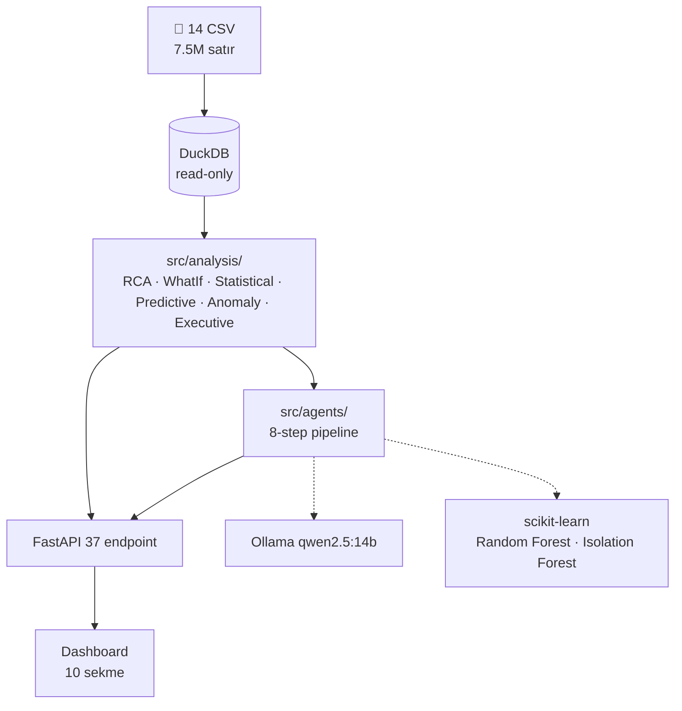

# CNC Anomaly Intelligence

> **Multi-Agent Factory Monitoring System** — Bursa/Trex hackathon için inşa edildi.

9 ay boyunca 12 CNC makinesinden toplanan **7.5M satır telemetri verisini** analiz ederek 12 büyük operasyonel problemi tespit eden, OEE iyileştirme senaryolarını simüle eden, finansal etkiyi hesaplayan ve **Türkçe AI raporu üreten** karar destek sistemi.

```
                    DuckDB 7.5M satır
                          │
              ┌───────────┴───────────┐
              ▼                       ▼
         Analiz Katmanı           Predictive ML
         (RCA · WhatIf ·          (Random Forest
          Statistical)             AUC 0.999)
              │                       │
              └───────────┬───────────┘
                          ▼
                 8-Agent LLM Pipeline
                          ▼
              FastAPI (37 endpoint)
                          ▼
                  10-Sekme Dashboard
```

---

## 🚀 Hızlı Başlangıç

```bash
# 1. Bağımlılıklar
pip install -r requirements.txt

# 2. Ollama LLM (opsiyonel — yoksa fallback rapor üretilir)
ollama pull qwen2.5:14b

# 3. Veriyi DuckDB'ye yükle (ilk kurulum, ~30 saniye)
python scripts/load_data.py

# 4. Uygulamayı başlat
python run.py
```

→ http://localhost:8001

---

## ✨ Özellikler

- ✓ **8-Agent LLM Pipeline** — Detector → RCA → EventContext → WhatIf → Financial → Prioritizer → Reporter → **Critic**
- ✓ **12 Problem Otomatik Tespiti** — Hava basıncı, acil durdurma, hayalet makineler, cycle time uyumsuzluğu, motor overload, ...
- ✓ **İstatistiksel Confidence** — Hardcoded değil, Wilson CI + sample size + concentration ratio ile veriden hesaplanır
- ✓ **Predictive Maintenance ML** — Random Forest classifier (AUC 0.999, F1 0.99) + alarm recurrence forecast
- ✓ **OEE What-If Simülasyonu** — A×P×Q yeniden hesaplama, 6 senaryo, **Corrected OEE** (tüm düzeltmeler birden)
- ✓ **Finansal Etki Hesabı** — Şeffaf varsayımlar, makine başı yıllık ROI, geri ödeme süresi
- ✓ **Critic Agent** — LLM raporundaki halüsinasyonu yakalar (rapordaki sayıları kanıt setiyle karşılaştırır)
- ✓ **Async Job Manager** — Uzun süren LLM çağrıları için job ID + polling pattern
- ✓ **Multi-Machine Karşılaştırma** — Yan yana tablo + radar chart
- ✓ **Alarm Timeline** — Son 60 günde hot day'ler + günlük dağılım
- ✓ **Print-friendly Executive Summary** — Yönetici/jüri sunumu için tek sayfa
- ✓ **Command Palette** (Ctrl+K) + 10 sekme arası klavye kısayolu

---

## 🏗 Mimari



---

## 📁 Klasör Yapısı

```
Trex Hackathon/
├── config/                # Merkezi konfigürasyon
├── scripts/load_data.py   # CSV → DuckDB
├── src/
│   ├── core/              # DB · cache · jobs · schemas
│   ├── analysis/          # Saf veri analizi (6 modül)
│   └── agents/            # 8-step LLM pipeline
├── api/main.py            # FastAPI + middleware
├── frontend/              # Dashboard (HTML + CSS + JS)
├── run.py                 # python run.py
└── AGENTS.md              # ← AI asistan onboarding rehberi
```

---

## 🛠 Teknoloji Yığını

| Katman | Araçlar |
|--------|---------|
| **Veri** | DuckDB (OLAP, columnar, in-process) |
| **Analiz** | pandas, numpy, scipy (Wilson CI, IQR, Mann-Whitney) |
| **ML** | scikit-learn (Random Forest, Isolation Forest), feature engineering |
| **Agents / LLM** | LangChain + Ollama (qwen2.5:14b), fallback deterministic |
| **API** | FastAPI, Pydantic, GZip + CORS middleware |
| **Frontend** | Vanilla JS + Chart.js, Inter font, dark theme |
| **Cache** | In-memory TTL decorator (`@cached(ttl=600)`) |

---

## 📚 Daha Fazla Belge

- **[`AGENTS.md`](AGENTS.md)** — OpenAI Codex / Claude / AI asistan onboarding rehberi (37 endpoint, pipeline kontratı, geliştirme konvansiyonları)
- **[`data/uludag_hackathon_dataset/docs/`](data/uludag_hackathon_dataset/docs/)** — Veri seti şeması, OEE formülleri, What-If analizi referansı
- **http://localhost:8001/docs** — FastAPI otomatik Swagger UI (sunucu açıkken)

---

## 🎯 Veri Akışı — Bir Örnek

> Kullanıcı **Makine 1** için analiz başlattı.

1. **Detector** → Makine 1'in `health_score = 12` (kritik)
2. **RCA** → 6 ilgili problem, en üstte *Kronik Hava Basıncı* (confidence **0.897** — Wilson CI, n=248)
3. **EventContext** → Son alarm `2026-05-22 07:45 — AIR PRESSURE FAILED`, ±15dk içinde 10 alarm, 2 duruş kaydı
4. **WhatIf** → Plansız duruşu %50 azaltsak: OEE %1.3 → **%55** (delta +0.45)
5. **Financial** → Günde ~8 saat kazanç ≈ **1.836 ₺/gün** (varsayımsal)
6. **Prioritizer** → Top aksiyon: *Cycle Time Düzeltmesi* (skor **87.4**)
7. **Reporter** → 8 başlıklı Türkçe yönetici raporu üretti
8. **Critic** → Rapordaki 29 sayıdan 12'si doğrulandı, 6'sı kanıt setinde yok → uyarı

→ Tüm bunlar `/api/agent/analyze?machine=Makine 1` çağrısının çıktısı.

---

## 📊 Veri Seti

- **12 makine**: Makine 1-11 + TurboCut
- **3 controller tipi**: Fanuc (alarm-rich), Mitsubishi (14 sensor sinyal), LibPlc/Nukon
- **9 ay**: Ağustos 2025 – Mayıs 2026
- **14 tablo**: MES (OEE, stoppage, workorder, alert) + Nightwatch (numeric, string telemetry)
- **Boyut**: ~7.5M satır toplam, en büyüğü `nightwatch_data` (6.3M)

---

## 🤝 Katkı

Yeni problem / agent / endpoint eklemeden önce **[`AGENTS.md`](AGENTS.md)** Bölüm H — *Sık Yapılan Görevler* tablosuna bakın. Pattern'i takip ederseniz çoğu değişiklik 1-2 dosya düzenlemesi.
