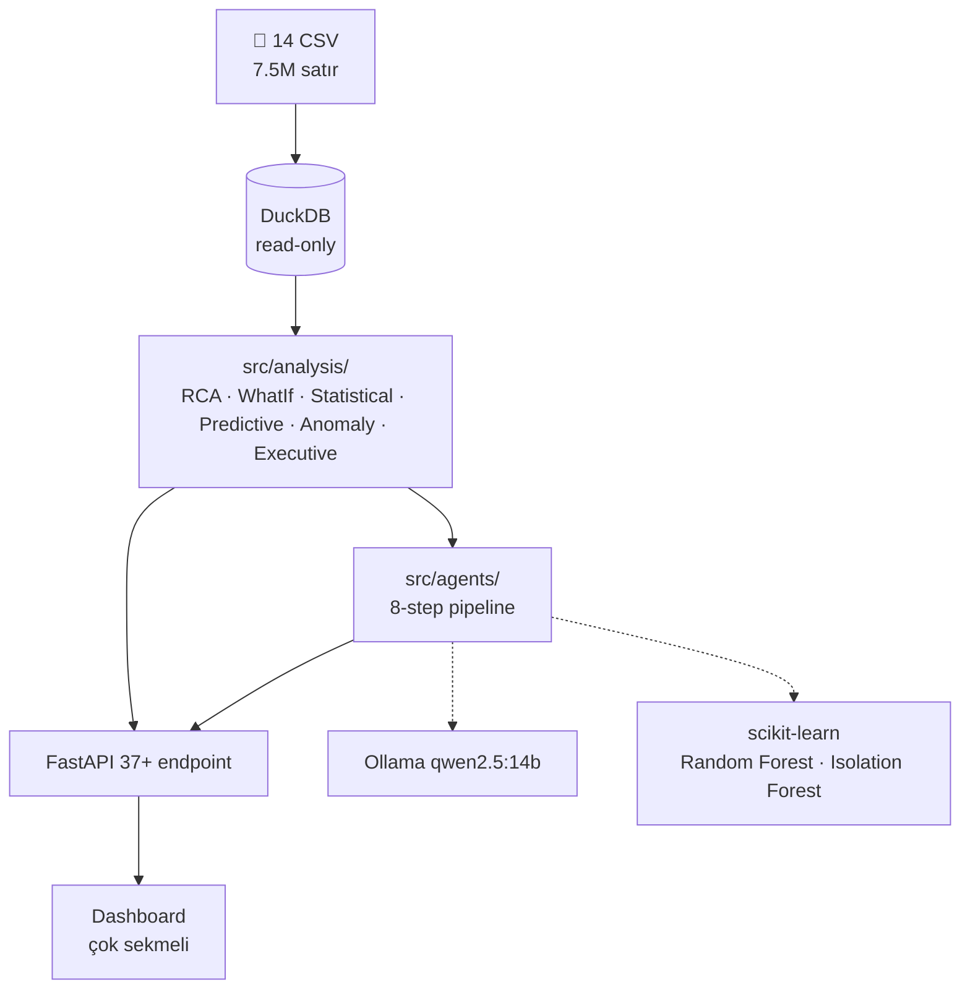

# CNC Anomaly Intelligence

> **Multi-Agent Factory Monitoring System** — Bursa/Trex hackathon için inşa edildi.

9 ay boyunca 12 CNC makinesinden toplanan **7.5M satır telemetri verisini** analiz ederek 17 operasyonel problemi tespit eden, OEE iyileştirme senaryolarını simüle eden, finansal etkiyi hesaplayan ve **Türkçe AI raporu üreten** karar destek sistemi.

```
                    DuckDB 7.5M satır
                          │
              ┌───────────┴───────────┐
              ▼                       ▼
         Analiz Katmanı           Predictive ML
         (RCA · WhatIf ·          (Random Forest
          Statistical)             AUC 0.999)
              │                       │
              └───────────┬───────────┘
                          ▼
                 8-Agent LLM Pipeline
                          ▼
              FastAPI (37+ endpoint)
                          ▼
                Çok Sekmeli Dashboard
```

---

## 🚀 Hızlı Başlangıç

```bash
# 1. Bağımlılıklar
pip install -r requirements.txt

# 2. Ollama LLM (opsiyonel — yoksa fallback rapor üretilir)
ollama pull qwen2.5:14b

# 3. Veriyi DuckDB'ye yükle (ilk kurulum, ~30 saniye)
python scripts/load_data.py

# 4. Uygulamayı başlat
python run.py
```

→ http://localhost:8001

---

## 🧭 Detaylı Çalıştırma Adımları

### 1. Ortamı Hazırla

Windows PowerShell için önerilen kurulum:

```powershell
python -m venv .venv
.\.venv\Scripts\Activate.ps1
python -m pip install --upgrade pip
pip install -r requirements.txt
```

Python 3.11-3.13 önerilir. Python 3.14 ile LangChain/Pydantic tarafında uyarı görülebilir; uygulama çalışmaya devam eder.

### 2. Veri Setini Kontrol Et

Proje DuckDB dosyasıyla çalışır:

```text
trex.duckdb
```

Eğer `trex.duckdb` yoksa veya CSV'lerden tekrar üretmek istiyorsanız:

```powershell
python scripts/load_data.py
```

Not: CSV dosyaları Git LFS pointer olarak geldiyse önce veri dosyalarının gerçekten inmiş olması gerekir. 130 byte civarı CSV dosyaları LFS pointer belirtisidir.

### 3. LLM Modelini Opsiyonel Kur

Reporter Agent için Ollama kullanılır. Model yoksa sistem deterministic fallback rapor üretir; RCA, What-If, ML ve Critic çalışmaya devam eder.

```powershell
ollama pull qwen2.5:14b
```

### 4. Uygulamayı Başlat

```powershell
python run.py
```

Açılacak adresler:

- Dashboard: http://localhost:8001
- Swagger/OpenAPI: http://localhost:8001/docs
- Health check: http://localhost:8001/api/health-check

### 5. Hızlı Smoke Test

Sunucu açıkken şu endpoint'ler tarayıcıdan veya terminalden kontrol edilebilir:

```powershell
curl http://localhost:8001/api/health-check
curl http://localhost:8001/api/health
curl http://localhost:8001/api/problems
curl "http://localhost:8001/api/whatif/corrected-oee?machine=Makine%201"
```

### 6. Demo Sırası

Jüri veya ürün demosu için önerilen akış:

1. `Fabrika Genel` ile makine sağlık skorlarını göster.
2. Bir makine kartına tıkla ve side panelde OEE, alarm, duruş ve RCA özetini göster.
3. `Problem Listesi` ile 17 RCA bulgusunu confidence ve kanıt zinciriyle göster.
4. `What-If` ile corrected OEE veya plansız duruş azaltma senaryosunu çalıştır.
5. `AI Agent` ile 8-agent pipeline sonucunu ve Türkçe raporu göster.
6. `Yönetici Özeti` ile iş etkisi ve önceliklendirilmiş aksiyonları bağla.
7. `AI Operations` ile canlı/agentic operasyon vizyonunu anlat.

---

## 🧪 Teslim Öncesi Kontrol Komutları

Kod değişikliği sonrası hızlı kontrol:

```powershell
python -m compileall api src config streaming
node --check frontend/static/js/app.js
```

Cache temizlemek için:

```powershell
curl -X POST http://localhost:8001/api/cache/clear
```

---

## ✨ Özellikler

- ✓ **8-Agent LLM Pipeline** — Detector → RCA → EventContext → WhatIf → Financial → Prioritizer → Reporter → **Critic**
- ✓ **17 Problem Otomatik Tespiti** — Hava basıncı, acil durdurma, hayalet makineler, cycle time uyumsuzluğu, motor overload, ek RCA bulguları, ...
- ✓ **İstatistiksel Confidence** — Hardcoded değil, Wilson CI + sample size + concentration ratio ile veriden hesaplanır
- ✓ **Predictive Maintenance ML** — Random Forest classifier (AUC 0.999, F1 0.99) + alarm recurrence forecast
- ✓ **OEE What-If Simülasyonu** — A×P×Q yeniden hesaplama, 6 senaryo, **Corrected OEE** (tüm düzeltmeler birden)
- ✓ **Finansal Etki Hesabı** — Şeffaf varsayımlar, günlük net fayda, geri ödeme süresi
- ✓ **Critic Agent** — LLM raporundaki halüsinasyonu yakalar (rapordaki sayıları kanıt setiyle karşılaştırır)
- ✓ **Async Job Manager** — Uzun süren LLM çağrıları için job ID + polling pattern
- ✓ **Multi-Machine Karşılaştırma** — Yan yana tablo + radar chart
- ✓ **Alarm Timeline** — Son 60 günde hot day'ler + günlük dağılım
- ✓ **Print-friendly Executive Summary** — Yönetici/jüri sunumu için tek sayfa
- ✓ **Command Palette** (Ctrl+K) + çok sekmeli dashboard navigasyonu
- ✓ **Factory AIOps / AI Operations Paneli** — Canlı izleme, agentic operasyon akışı ve gelecek senaryosu

---

## 🏗 Mimari



---

## 📁 Klasör Yapısı

```
Trex Hackathon/
├── config/                # Merkezi konfigürasyon
├── scripts/load_data.py   # CSV → DuckDB
├── src/
│   ├── core/              # DB · cache · jobs · schemas
│   ├── analysis/          # Saf veri analizi (6 modül)
│   └── agents/            # 8-step LLM pipeline
├── api/main.py            # FastAPI + middleware
├── frontend/              # Dashboard (HTML + CSS + JS)
│   ├── index.html
│   └── static/            # Aktif runtime asset'leri: css/app.css + js/app.js
├── streaming/             # Opsiyonel canlı/agentic operasyon simülasyonu
├── run.py                 # python run.py
└── AGENTS.md              # ← AI asistan onboarding rehberi
```

---

## 🛠 Teknoloji Yığını

| Katman | Araçlar |
|--------|---------|
| **Veri** | DuckDB (OLAP, columnar, in-process) |
| **Analiz** | pandas, numpy, saf Python istatistikleri (Wilson CI, IQR, concentration ratio) |
| **ML** | scikit-learn (Random Forest, Isolation Forest), feature engineering |
| **Agents / LLM** | LangChain + Ollama (qwen2.5:14b), fallback deterministic |
| **API** | FastAPI, Pydantic, GZip + CORS middleware |
| **Frontend** | Vanilla JS + Chart.js, Inter font, dark theme |
| **Cache** | In-memory TTL decorator (`@cached(ttl=600)`) |

---

## 🤖 8-Agent Pipeline

Pipeline deterministik analizleri LLM'e yaptırmaz; Python/SQL/ML katmanı ölçer, LLM sadece kanıta bağlı rapor üretir.

| Sıra | Agent | Görev |
|------|-------|-------|
| 1 | Detector | Makine sağlık skorlarını ve kritik makineleri çıkarır |
| 2 | RCA | 17 problemi tarar, confidence ve kanıt zinciri ekler |
| 3 | EventContext | Seçilen olay için alarm/duruş/iş emri/program bağlamı toplar |
| 4 | WhatIf | RCA'ya bağlı OEE senaryolarını çalıştırır |
| 5 | Financial | OEE delta'sını varsayımsal iş etkisine çevirir |
| 6 | Prioritizer | Severity × confidence × impact × feasibility ile aksiyon sıralar |
| 7 | Reporter | Türkçe yönetici raporu üretir; Ollama yoksa fallback kullanır |
| 8 | Critic | Rapordaki sayıları kanıt setiyle karşılaştırır |

Finansal değerler dataset'ten gelmez; kullanıcıya açık varsayım katmanı olarak sunulur.

---

## 🧩 Dashboard Panelleri

- `Fabrika Genel`: Makine sağlık kartları, controller grupları, side panel detayları.
- `Canlı İzleme`: Power BI benzeri canlı üretim/operasyon görünümü.
- `AI Agent`: 8-agent pipeline, Türkçe rapor, Critic doğrulaması.
- `Yönetici Özeti`: KPI, potansiyel OEE iyileştirmesi, öncelikli aksiyonlar.
- `AI Operations`: Agentic operasyon vizyonu ve canlı operasyon senaryosu.
- `Problem Listesi`: 17 RCA bulgusu, confidence, impact area, evidence chain.
- `What-If`: Corrected OEE, plansız duruş azaltma, finansal varsayımlar.
- `OEE Trend`: Makine bazlı haftalık OEE/A/P/Q trendleri.
- `ML Anomali`: Health score, counter spike ve Mitsubishi sensör analizi.
- `Predictive ML`: Random Forest cycle failure ve alarm forecast.
- `Veri Kalitesi`: OEE, sensör, duruş ve cycle-time kalite kontrolleri.
- `Karşılaştırma`: Makine metriklerini yan yana karşılaştırma.
- `Timeline`: Son dönem alarm yoğunluğu ve hot-day analizi.

---

## 🔌 Önemli API Endpoint'leri

| Endpoint | Açıklama |
|----------|----------|
| `GET /api/health` | Makine health score ve genel durum |
| `GET /api/problems` | 17 RCA problemi, confidence ve evidence alanları |
| `GET /api/whatif/corrected-oee?machine=Makine%201` | Birim/veri düzeltmeleriyle corrected OEE |
| `GET /api/whatif/reduce-unplanned?machine=Makine%201&reduction_pct=50` | Plansız duruş azaltma simülasyonu |
| `GET /api/whatif/financial?delta_oee=0.05&machine=Makine%201` | Varsayımsal finansal etki |
| `GET /api/agent/analyze?machine=Makine%201` | Senkron 8-agent analiz pipeline'ı |
| `POST /api/agent/start?machine=Makine%201` | Async agent job başlatır |
| `GET /api/agent/job/{job_id}` | Async job durumunu döndürür |
| `GET /api/executive` | Yönetici özeti |
| `GET /api/timeline?days=60` | Alarm timeline |
| `GET /api/cache/stats` | Cache istatistikleri |

---

## 📚 Daha Fazla Belge

- **[`AGENTS.md`](AGENTS.md)** — OpenAI Codex / Claude / AI asistan onboarding rehberi (37+ endpoint, pipeline kontratı, geliştirme konvansiyonları)
- **[`data/uludag_hackathon_dataset/docs/`](data/uludag_hackathon_dataset/docs/)** — Veri seti şeması, OEE formülleri, What-If analizi referansı
- **http://localhost:8001/docs** — FastAPI otomatik Swagger UI (sunucu açıkken)

---

## 🎯 Veri Akışı — Bir Örnek

> Kullanıcı **Makine 1** için analiz başlattı.

1. **Detector** → Makine 1'in `health_score = 12` (kritik)
2. **RCA** → 6 ilgili problem, en üstte *Kronik Hava Basıncı* (confidence **0.897** — Wilson CI, n=248)
3. **EventContext** → Son alarm `2026-05-22 07:45 — AIR PRESSURE FAILED`, ±15dk içinde 10 alarm, 2 duruş kaydı
4. **WhatIf** → Plansız duruşu %50 azaltsak: OEE %1.3 → **%55** (delta +0.45)
5. **Financial** → Günde ~8 saat kazanç ≈ **1.836 ₺/gün** (varsayımsal)
6. **Prioritizer** → Top aksiyon: *Cycle Time Düzeltmesi* (skor **87.4**)
7. **Reporter** → 8 başlıklı Türkçe yönetici raporu üretti
8. **Critic** → Rapordaki 29 sayıdan 12'si doğrulandı, 6'sı kanıt setinde yok → uyarı

→ Tüm bunlar `/api/agent/analyze?machine=Makine 1` çağrısının çıktısı.

---

## ⚙️ OEE ve Corrected OEE Notu

Ham dataset'te bazı OEE kayıtlarında `WorkingTime` milisaniye ölçeğinde, `PlannedTime` ise saniye veya yanlış ölçekli ideal süre gibi davranır. Bu yüzden ham `P` değeri sıfıra çok yakın olabilir ve ham OEE olduğundan düşük görünür.

Proje bunu veri kalitesi problemi olarak ele alır:

- Ham OEE saklanır ve problem kanıtı olarak gösterilir.
- `Corrected OEE` senaryosu zaman birimi/konfigürasyon etkisini normalize ederek A × P × Q'yu yeniden hesaplar.
- Demo anlatısında bu durum “veri/konfigürasyon düzeltmesi yapılmadan KPI yanıltıcıdır” mesajını güçlendirir.

Bu nedenle dashboard'da ham OEE ile corrected OEE arasındaki fark bir hata değil, RCA/What-If hikayesinin ana bulgularından biridir.

---

## 📊 Veri Seti

- **12 makine**: Makine 1-11 + TurboCut
- **3 controller tipi**: Fanuc (alarm-rich), Mitsubishi (14 sensor sinyal), LibPlc/Nukon
- **9 ay**: Ağustos 2025 – Mayıs 2026
- **14 tablo**: MES (OEE, stoppage, workorder, alert) + Nightwatch (numeric, string telemetry)
- **Boyut**: ~7.5M satır toplam, en büyüğü `nightwatch_data` (6.3M)

---

## 🛠 Sorun Giderme

| Durum | Çözüm |
|-------|-------|
| Dashboard açılmıyor | `python run.py` çalışıyor mu ve port `8001` boş mu kontrol edin |
| API 500 dönüyor | `trex.duckdb` var mı, CSV yüklemesi tamamlandı mı kontrol edin |
| LLM raporu geç geliyor | Ollama/model yoksa fallback beklenir; demo için async job veya fallback kullanılabilir |
| OEE çok düşük görünüyor | Corrected OEE panelini kontrol edin; ham veride zaman birimi/stock cycle uyumsuzluğu vardır |
| Static dosya yüklenmiyor | Aktif asset path'leri `/static/css/app.css` ve `/static/js/app.js` olmalıdır |
| Cache eski sonuç gösteriyor | `POST /api/cache/clear` çağırın veya sunucuyu yeniden başlatın |

---

## 📌 Geliştirme Notları

- Aktif frontend bundle: `frontend/static/js/app.js`.
- Aktif stylesheet: `frontend/static/css/app.css`.
- `frontend/js/*.js` modüler deneme dosyaları olabilir; runtime'da `index.html` aktif olarak `/static/js/app.js` yükler.
- DuckDB bağlantısı read-only singleton olarak kullanılır; uzun paralel query'lerde dikkatli olun.
- Finansal etki her zaman varsayımsaldır; gerçek maliyet verisi dataset içinde yoktur.
- Reporter prompt'u İngilizcedir, kullanıcıya dönen rapor Türkçedir.
- LLM yoksa sistem fallback rapor üretir; analiz katmanı LLM'e bağımlı değildir.

---

## 🤝 Katkı

Yeni problem / agent / endpoint eklemeden önce **[`AGENTS.md`](AGENTS.md)** Bölüm H — *Sık Yapılan Görevler* tablosuna bakın. Pattern'i takip ederseniz çoğu değişiklik 1-2 dosya düzenlemesi.
